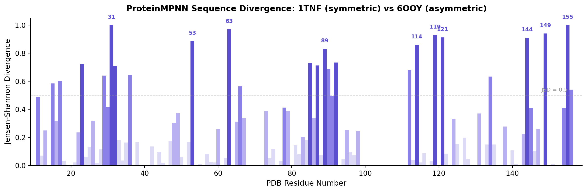

# ProteinMPNN Conformational Sensitivity Analysis

**Does inverse folding see the difference between two crystal structures of the same protein?**

TNF-alpha exists in two crystallographically distinct states: a symmetric homotrimer (PDB: [1TNF](https://www.rcsb.org/structure/1TNF)) and an asymmetric form with a disrupted subunit interface (PDB: [6OOY](https://www.rcsb.org/structure/6OOY)). This project asks whether [ProteinMPNN](https://github.com/dauparas/ProteinMPNN) — an inverse folding model trained to predict amino acid sequences from backbone coordinates — can detect the structural differences between these two conformations.

<p align="center">
  
</p>
<p align="center">
  <em>ProteinMPNN designs different sequences for the symmetric (1TNF) and asymmetric (6OOY) TNF-alpha backbones. Jensen-Shannon divergence between the per-position amino acid distributions reveals which residues are most sensitive to the conformational change.</em>
</p>

---

## Approach

1. **Sequence design**: Run ProteinMPNN on both backbones (150 designed sequences each, temperature 0.1, all chains designed as homomers)
2. **Divergence analysis**: Compute Jensen-Shannon divergence (JSD) between the per-position amino acid frequency distributions from 1TNF vs 6OOY designs
3. **Mutation sensitivity**: Use ProteinMPNN's conditional probability mode to score every single-point mutation on both backbones, computing DDscores (ΔΔlog-likelihood) that capture backbone-dependent fitness differences
4. **Interactive visualization**: Mol\*-based viewers with 3D structure coloring by divergence or DDscore, synchronized across both structures

## Key Findings

- **ProteinMPNN clearly distinguishes the two conformations.** Several positions show JSD = 1.0 (completely different sequence preferences), concentrated at the disrupted subunit interface in 6OOY
- **Per-chain asymmetry in DDscores.** The three chains of the 6OOY trimer show different mutation sensitivities — ProteinMPNN captures the symmetry breaking without being told about it
- **Positions 31 and 155** emerge as the most divergent residues, both located at the interface region that differs most between the two crystal structures

## Connection to ConforMix-Boltz

This analysis provides orthogonal validation for the [ConforMix-Boltz](https://github.com/rafwiewiora/conformix-boltz) project: if ProteinMPNN's sequence preferences change dramatically between symmetric and asymmetric TNF-alpha conformations, then the conformational states accessed by guided diffusion are genuinely structurally distinct — not just noise.

## Repository Structure

```
├── run_mpnn.py                    # Collect ProteinMPNN designs via API
├── run_6ooy_homomer.py            # 6OOY-specific homomer design run
├── analyze_results.py             # JSD divergence analysis across positions
├── score_mutants.py               # DDscore mutation sensitivity analysis
├── generate_html.py               # Interactive Mol* divergence viewer
├── generate_mutation_html.py      # Interactive Mol* DDscore viewer
├── proteinmpnn_comparison.html    # Divergence visualization (open in browser)
├── mutation_sensitivity.html      # Mutation sensitivity visualization
├── divergence_analysis.csv        # Per-position JSD values
├── mutation_ddg_scores.csv        # Full DDscore results
└── figures/                       # Analysis figures
```

## Usage

The interactive HTML viewers can be opened directly in a browser:

```bash
open proteinmpnn_comparison.html    # JSD divergence viewer
open mutation_sensitivity.html      # DDscore mutation viewer
```

To rerun the analysis from scratch:

```bash
# 1. Collect ProteinMPNN designs (uses HuggingFace Spaces API)
python run_mpnn.py

# 2. Compute divergence
python analyze_results.py

# 3. Score mutations (requires local ProteinMPNN installation)
python score_mutants.py

# 4. Generate interactive viewers
python generate_html.py
python generate_mutation_html.py
```

## Dependencies

- Python 3.10+
- NumPy, Requests
- [ProteinMPNN](https://github.com/dauparas/ProteinMPNN) (for mutation scoring only; sequence design uses the HuggingFace Spaces API)

## References

- Dauparas et al. "Robust deep learning–based protein sequence design using ProteinMPNN." *Science* 378, 49–56 (2022).
- Mukai et al. "Crystal structure of TNF-alpha in complex with small-molecule antagonist." PDB: 6OOY (2019).

## License

MIT
